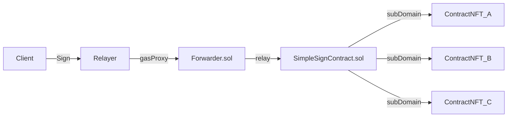

```mermaid
graph LR
    Client -->|Sign| Relayer
    Relayer -->|gasProxy| Forwarder.sol
    Forwarder.sol -->|relay| SimpleSignContract.sol
    SimpleSignContract.sol -->|subDomain| ContractNFT_A
	SimpleSignContract.sol -->|subDomain| ContractNFT_B
	SimpleSignContract.sol -->|subDomain| ContractNFT_C
	

    %% subgraph "architecture"
        Client
		Relayer
        Forwarder.sol
		%% subgraph " "
		SimpleSignContract.sol
		%% end
    %% end
		ContractNFT_A
		ContractNFT_B
		ContractNFT_C
```